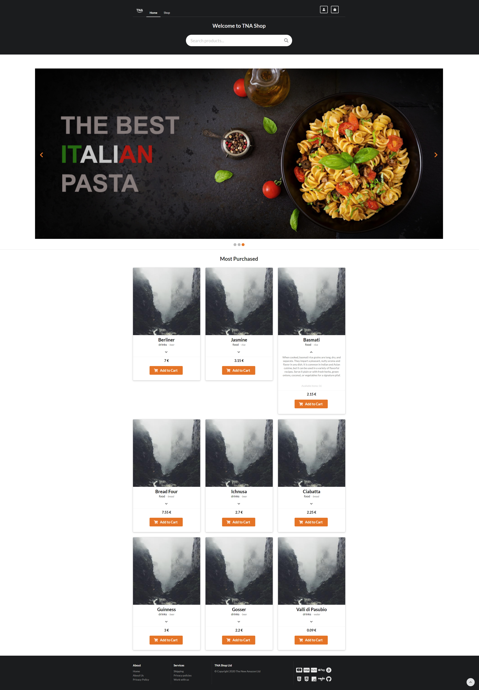

# TNA - Web app project:

  

### Project:
Web Applications exam project AA. 2019-2020

___

### Description:
The project consists of the creation of a web app for the management of an e-commerce website with user registration, many db operations, product search functions, categories filters, profile management, recent orders, shopping cart and organization of available objects.

In the [Documentation.pdf](https://github.com/filippopetri/TNA/blob/main/Documentation.pdf) file there is the italian complete description of the project.

___

  Copyright &copy; 2020 Filippo Petri - Andrea Agostini - Luca Molettieri

___

     Homepage    
     Shop page    
      Login/register - Shopping cart    
      Profile tab 1 & 2    
      Profile tab 3 & 4    
     About page
   

---

### Technologies used:

  
  
  
  
  
  
  
  
  

