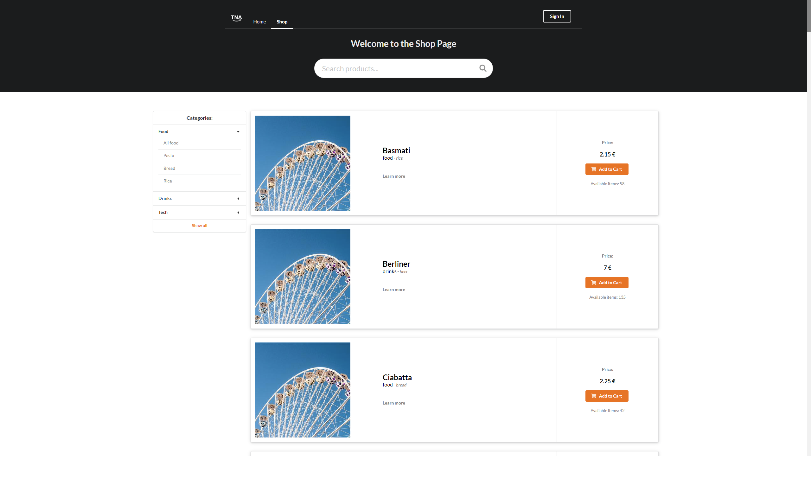
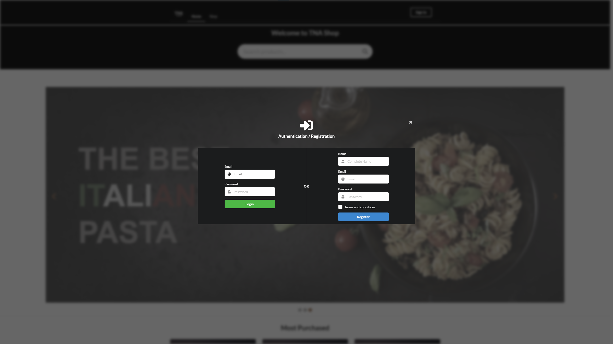
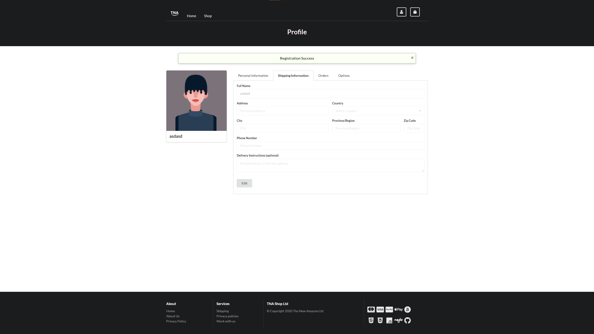
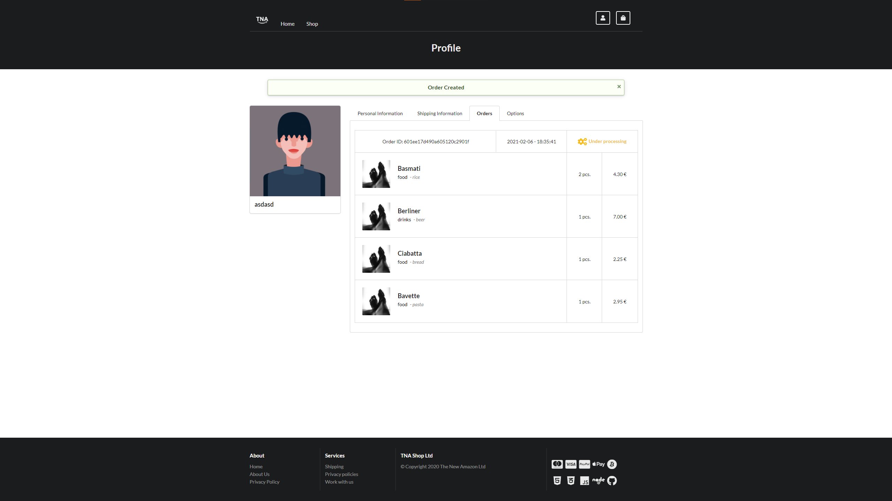
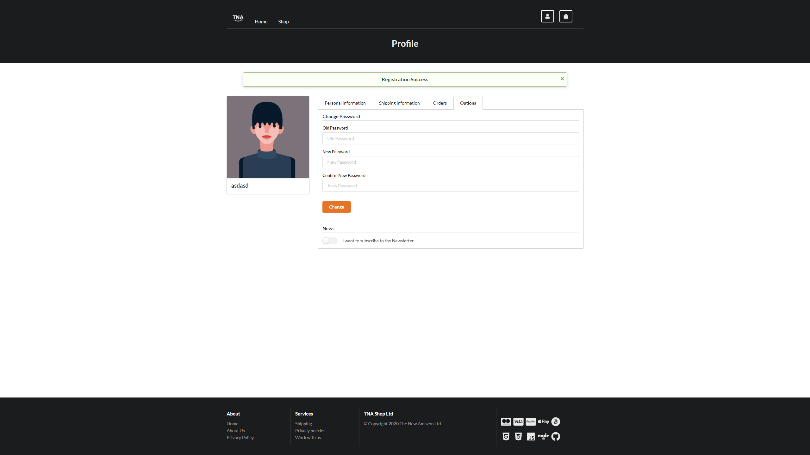
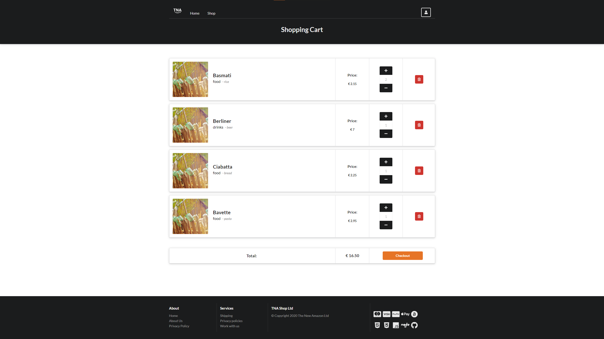

# TNA - Web app project

  

### Project
Web Applications exam project AA. 2019-2020 - &copy; Petri Filippo - Andrea Agostini - Molettieri Luca

---

### Description
The project consists of the creation of a web app for the management of an e-commerce website with user registration, many db operations, product search functions, categories filters, profile management, recent orders, shopping cart and organization of available objects.
The 

---

     Homepage    
     Shop page    
     Login/register    
     Profile tab 1    
     Profile tab 2    
     Profile tab 3    
     Profile tab 4    
     Login/register    
   

---

### Technologies:

  
  
  
  
  
  
  
  
  

